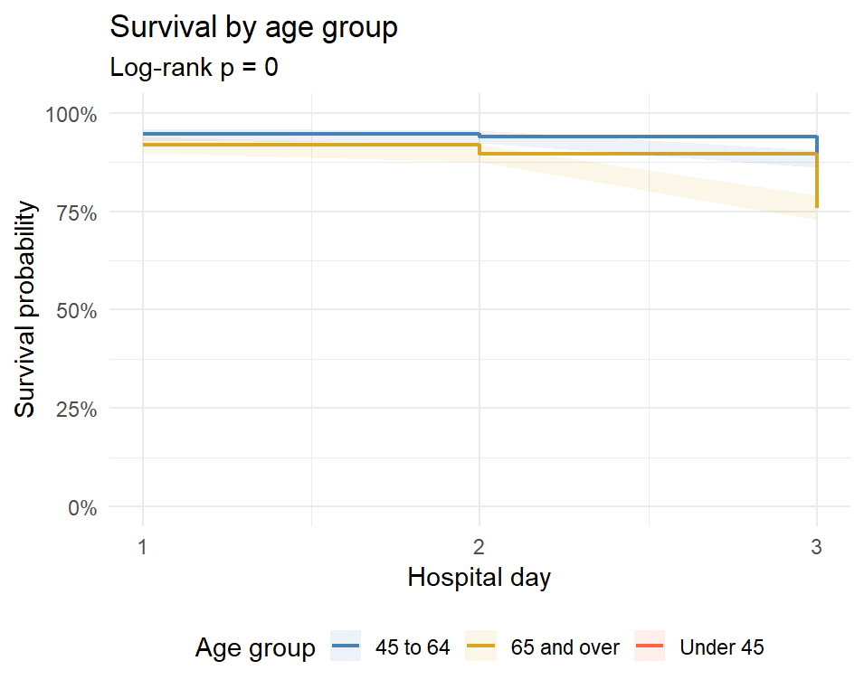
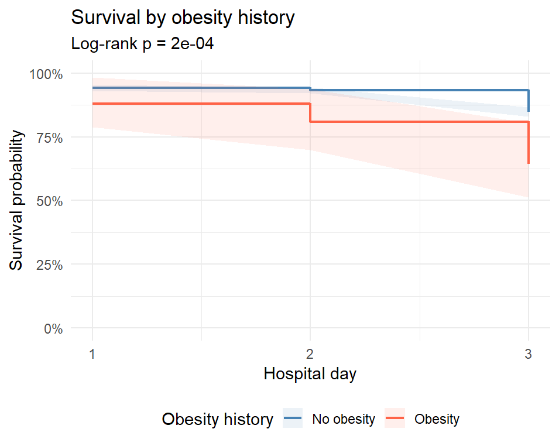
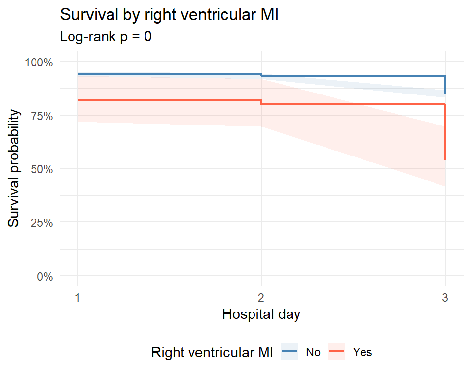
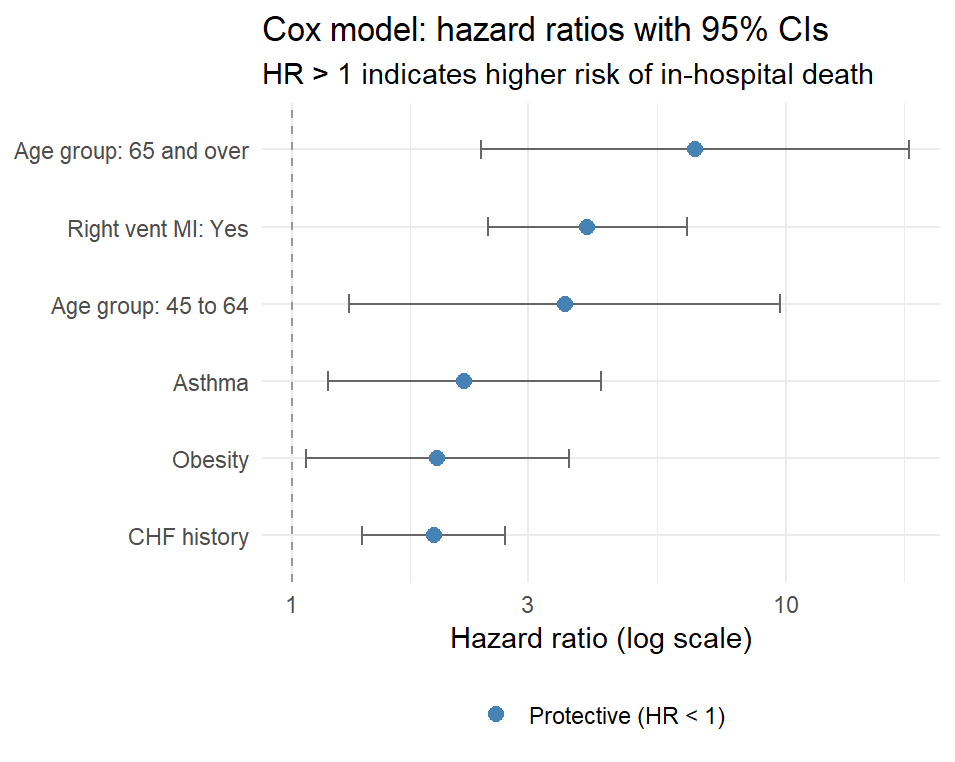
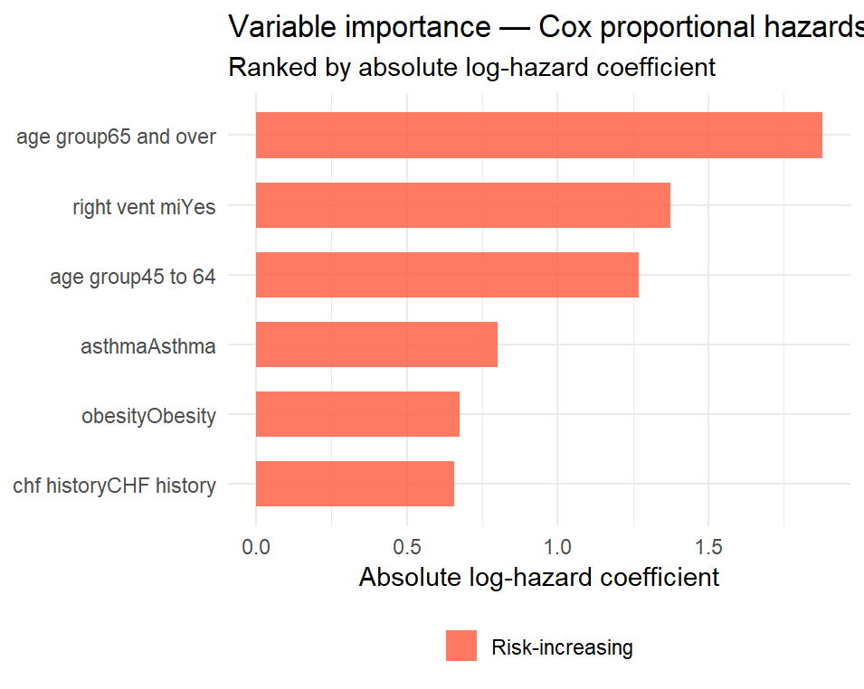
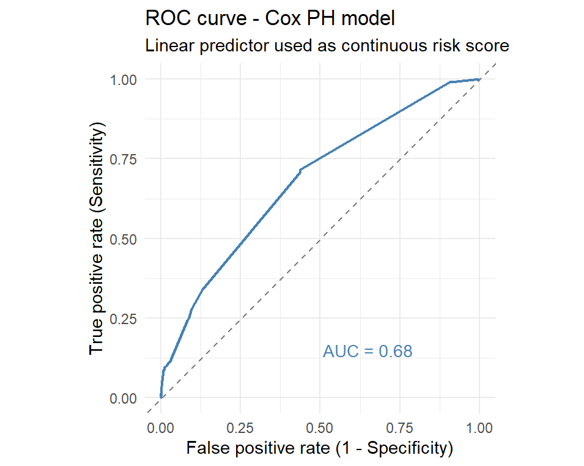
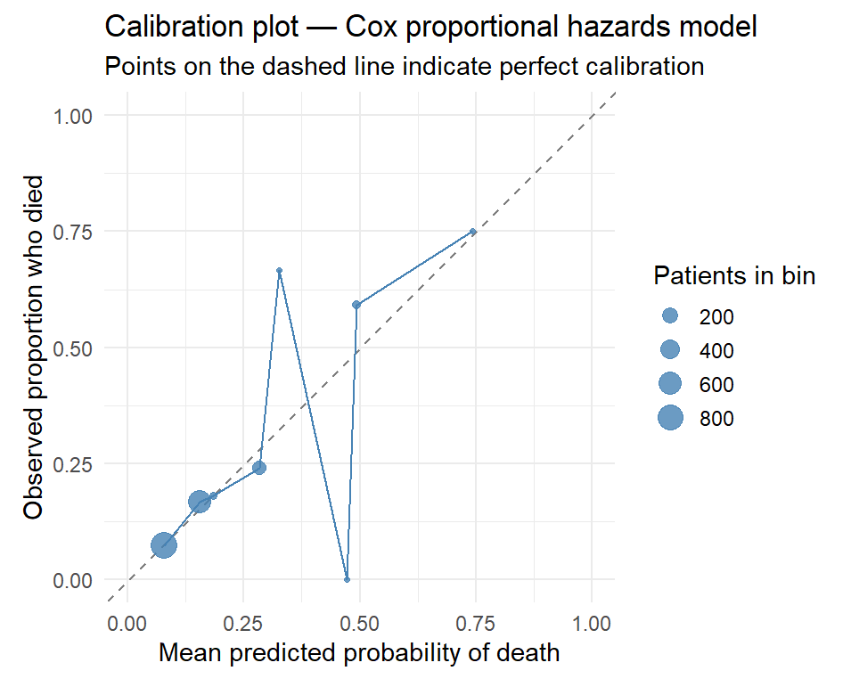

# Myocardial Infarction: Survival Analysis
### Kaplan-Meier Estimation · Cox Proportional Hazards · Model Diagnostics

[](https://www.r-project.org/)
[](https://creativecommons.org/licenses/by/4.0/)
[](https://archive.ics.uci.edu/dataset/579/myocardial+infarction+complications)

---

## Overview

Predicting who will die after a heart attack is only part of the clinical problem. Equally important and often overlooked in binary classification models is understanding when patients are most at risk and which characteristics drive that timing. A patient who dies within hours of admission faces a fundamentally different clinical situation than one who deteriorates on day two or three, yet a logistic regression model treats both outcomes as identical. This project seeks to model what happens after the heart attack, specifically during those three days in the hospital. Given that a patient just had a heart attack and was admitted, what is their risk of dying before they leave?

This project applies survival analysis to a dataset of 1,700 myocardial infarction (MI) patients admitted to Krasnoyarsk Interdistrict Clinical Hospital No. 20 (Russia, 1992–1995). Rather than predicting a binary outcome, the analysis models the *hazard*, the instantaneous risk of dying at any point during the hospital stay and examines how five key clinical predictors modify that risk over time.

The five predictors were identified as the strongest independent risk factors and span distinct clinical domains:

| Predictor | Clinical domain |
|---|---|
| Age group | Demographics |
| Obesity history | Metabolic comorbidity |
| Bronchial asthma history | Inflammatory comorbidity |
| Chronic heart failure history | Cardiac history |
| Right ventricular MI at admission | Acute presentation |

The dataset is publicly available from the [UCI Machine Learning Repository](https://archive.ics.uci.edu/dataset/579/myocardial+infarction+complications) (DOI: [10.24432/C53P5M](https://doi.org/10.24432/C53P5M)) and downloads automatically. No manual setup required.

---

## The Dataset

| | |
|---|---|
| **Source** | UCI Machine Learning Repository |
| **Patients** | 1,700 |
| **Input features** | 111 (medical history, ECG results, blood tests, medications) |
| **Outcome** | `LET_IS`: 0 = survived; 1–7 = seven distinct causes of death |
| **Time variable** | Hospital day (1, 2, or 3) — proxy for time to event |
| **Missing data** | ~7.6% across all variables |

The outcome `LET_IS` is collapsed to a binary event indicator (0 = censored/survived, 1 = died from any cause). In survival analysis, *censoring* refers to incomplete observation of the event of interest. In this case, death from any cause following a myocardial infarction. A patient is censored when the study period (the three-day hospital admission window) ends before death is observed, but it is known that the patient survived at least until that point. Since all 1,700 patients in this dataset were admitted following a confirmed heart attack, the event being tracked is not the heart attack itself but whether and when death occurs during the hospital stay.

There's no direct timestamp in the data. Instead, time is approximated using a variable that tracks whether a patient is in their first day of hospitalization, a middle day, or their last. That three-stage sequence: admission, middle discharge is in chronological order. Patients discharged alive at the end of day 3 are *right-censored*, we know they survived the observation window, but cannot observe what happens after discharge.

---

## Patient Cohort

The table below summarises the patient population split by outcome. 
Patients who died were older on average and had higher rates of every comorbidity examined.

| Variable | Survived | Died |
|---|---|---|
| N | 1,429 | 271 |
| Age — mean (SD) | 61.2 (11.1) | 65.8 (10.4) |
| Male (%) | 62.1% | 64.2% |
| Obesity (%) | 2.2% | 4.8% |
| Bronchial asthma (%) | 1.7% | 5.2% |
| Diabetes (%) | 12.9% | 17.3% |
| Chronic heart failure (%) | 9.4% | 18.8% |
| Right ventricular MI (%) | 2.4% | 7.4% |

---

## Methods

### Part A — Kaplan-Meier Estimation

The **Kaplan-Meier (KM) estimator** is a nonparametric method for estimating the survival function S(t), the probability of surviving beyond time t, directly from censored data. It makes no distributional assumptions about event times. It is the standard first step in any survival analysis.

The estimator is defined as:

```
S(t) = ∏  (1 - dᵢ / nᵢ)
      tᵢ ≤ t
```

where dᵢ is the number of deaths observed at time tᵢ and nᵢ is the number of patients still at risk (neither dead nor censored) just before tᵢ. The product runs over all observed event times up to and including t. At each event time, the survival probability drops by the fraction of at-risk patients who die, patients who have been censored before tᵢ are simply removed from the risk set without contributing to the probability drop.

KM curves are estimated separately for each predictor subgroup. Group differences are formally tested using the **log-rank test**, which compares observed vs. expected death counts across groups under the null hypothesis that all groups share the same underlying survival function:

```
H₀: S₁(t) = S₂(t) = ... = Sₖ(t)  for all t
```

The log-rank statistic follows a chi-squared distribution with k−1 degrees of freedom under H₀. A p-value < 0.05 is taken as evidence of a statistically significant difference in survival between groups.

KM curves and the log-rank test are **unadjusted**. They show the marginal relationship between a single predictor and survival without controlling for the other four predictors. Two patients with the same age group may differ in obesity status, cardiac history, and MI type, all of which also affect survival. The Cox model in Part B provides the adjusted estimates that account for this.

### Part B — Cox Proportional Hazards Model

The **Cox proportional hazards model** is a semiparametric regression framework that simultaneously adjusts for multiple predictors while modelling the time-to-event outcome. Rather than estimating the survival function directly, it models the **hazard function** h(t|X): the instantaneous rate of dying at time t for a patient with covariate vector X, given survival to that point:

```
h(t | X) = h₀(t) × exp(β₁·age_group + β₂·obesity + β₃·asthma
                        + β₄·chf_history + β₅·right_vent_mi)
```

The baseline hazard h₀(t) captures the underlying time trend shared by all patients and is left completely unspecified, this is what makes the model semiparametric. The exponential term captures how each predictor multiplicatively shifts the hazard relative to that baseline. Exponentiating each coefficient yields a **hazard ratio (HR)**:

```
HR = exp(βⱼ)
```

A hazard ratio of 2.5 for a given predictor means patients with that characteristic are dying at 2.5 times the instantaneous rate of the reference group at any given moment, holding all other predictors constant. HR > 1 indicates increased risk; HR < 1 indicates a protective effect; HR = 1 means no effect.

The key underlying assumption is **proportional hazards**, that the hazard ratio between any two patients is constant over the entire follow-up period. In other words, if patients with right ventricular MI have twice the hazard of those without, that ratio of two holds at day 1, day 2, and day 3. This assumption is tested using **Schoenfeld residuals** via `cox.zph()`: under the proportional hazards assumption, Schoenfeld residuals should show no systematic trend with time. A significant p-value (< 0.05) for a predictor suggests its effect is time-varying, which in this dataset is clinically plausible, the impact of acute haemodynamic findings at admission may be very large in the first hours and attenuate as the patient stabilises.

### Part C — Model Diagnostics

Three diagnostic outputs assess how well the Cox model discriminates between patients and how reliably its predicted probabilities correspond to observed outcomes.

**ROC curve and AUC.** The Cox model's linear predictor, the log-hazard score assigned to each patient, is used as a continuous risk ranking. The ROC curve plots sensitivity (true positive rate) against 1, specificity (false positive rate) across all possible thresholds for converting that score into a binary classification. The **Area Under the Curve (AUC)** summarises overall discriminative ability in a single number: AUC = 0.5 means the model performs no better than random; AUC = 1.0 indicates perfect discrimination. An AUC above 0.70 is generally considered clinically useful for prognostic models.

**Calibration plot.** Discrimination and calibration are distinct properties. A model can rank patients correctly (high AUC) while still predicting systematically wrong probabilities. The calibration plot checks this by binning patients into ten equal groups by predicted probability, then plotting the mean predicted probability in each bin against the observed proportion who actually died. Points lying on the 45-degree diagonal indicate a perfectly calibrated model. Systematic departure above the diagonal signals underprediction; below it signals overprediction.

**Variable importance.** Predictors are ranked by the absolute magnitude of their log-hazard coefficient, how strongly each one moves the hazard in either direction, regardless of sign. This provides a model-agnostic summary of which predictors carry the most weight and complements the hazard ratio forest plot, which shows direction and precision but not relative ranking.

---

## Key Findings

### Kaplan-Meier — unadjusted survival differences

Survival curves differed significantly by age group (log-rank p < 0.05), with the 65-and-over cohort showing the steepest early decline. The survival gap between age groups is most pronounced in the first 24 hours, suggesting that age-related risk concentrates in the acute phase rather than accumulating over the hospital stay.

Obesity and right ventricular MI also produced visually and statistically distinct survival curves. Patients with right ventricular MI showed a sharp early drop that was not observed in other subgroups, consistent with the haemodynamic mechanism: right ventricular dysfunction directly impairs forward circulation and can precipitate cardiogenic shock rapidly after admission.

### Cox model — adjusted hazard ratios

After simultaneously adjusting for all five predictors, right ventricular MI and older age group retained the largest hazard ratios, consistent with the findings from the companion logistic regression. The presence of bronchial asthma and chronic heart failure also remained independently associated with increased hazard, confirming that their effect in the logistic model was not confounded by the other predictors.

The proportional hazards assumption held for most predictors. Where marginal evidence of time-varying effects was detected, particularly for predictors related to acute haemodynamic status at admission, the pattern was clinically coherent: their hazard impact is largest immediately after admission and attenuates in patients who survive the first 24 hours.

### Concentration of early mortality

One of the most clinically significant findings is that the vast majority of in-hospital deaths in this dataset occur within the first 24 hours. This is visible in every KM curve as a sharp early step, and it has a direct practical implication: admission-time characteristics carry more predictive weight than the day 2 and day 3 status variables, and the window for intervention that changes the outcome is narrow. Any risk stratification model deployed in this setting would need to be applied at or shortly after admission to be actionable.

---

## Figures

---

### Kaplan-Meier survival curves

**Survival by age group**



Three survival curves, one per age band. The gap between the 65-and-over group
and younger patients is visible from day 1 and widens over time. The log-rank
p-value in the subtitle confirms whether the separation is statistically significant.

---

**Survival by obesity history**



Two curves comparing patients with and without obesity history. Because obesity
is rare in this dataset (~3%), confidence bands around the obese group are wider.
A steep early drop in the obese group is consistent with the odds ratio of 3.19
found in the companion logistic model.

---

**Survival by right ventricular MI**



The most visually striking of the three KM plots. A sharp early drop in the right
ventricular MI curve within the first 24 hours is consistent with the haemodynamic
mechanism, RV dysfunction directly impairs forward circulation and can precipitate
cardiogenic shock rapidly after admission.

---

### Cox model outputs

**Hazard ratios with 95% confidence intervals**



Each point is the estimated hazard ratio for that predictor after adjusting for all
others. Red points are risk-increasing (HR > 1), blue are protective (HR < 1).
The dashed line at HR = 1 is the reference. Confidence intervals that do not cross
the line indicate statistical significance.

---

**Variable importance**



Predictors ranked by absolute log-hazard coefficient, the strength of each
predictor's contribution regardless of direction. Complements the forest plot:
where the forest plot shows direction and precision, this plot shows raw magnitude
and ranking.

---

### Diagnostics

**ROC curve**



Plots sensitivity against 1,  specificity as the classification threshold varies
across the Cox linear predictor. The diagonal dashed line is a random classifier
(AUC = 0.5). Values above 0.70 are generally considered clinically useful for
prognostic models.

---

**Calibration plot**



Patients are divided into ten bins by predicted probability of death. Mean predicted
probability in each bin is plotted against the observed proportion who actually died.
Points on the diagonal indicate perfect calibration. Points above the line mean the
model underpredicts risk; below means overprediction. Smaller points reflect fewer
patients in that bin, common at the high-probability end due to class imbalance.

---

## Limitations

**Coarse time variable**: Survival analysis works best when you know exactly when each event happened, down to the hour if possible. This dataset only tells us which day a patient was on: day 1, day 2, or day 3. That three-point scale is a rough approximation of time rather than a true continuous measure. The practical consequence is that we cannot detect subtle changes in risk that happen within a single day, and we cannot apply parametric survival models, methods like Weibull or log-normal regression that fit a smooth mathematical curve to the hazard over time because those models require a continuous time variable to estimate properly. Think of it like trying to describe a detailed landscape using only three elevation readings. You get the general shape but miss everything in between.

**Right-censoring assumption**: When a patient is discharged alive and their record is censored, the Cox model assumes that discharge carries no information about their future risk. In other words, patients were sent home because they recovered, not because they were too sick to benefit from further care. This is called non-informative censoring, and in a short three-day hospital window it is a reasonable assumption. A patient discharged on day 2 was almost certainly improving. However, this assumption cannot be formally tested from the data we have. We simply cannot observe what happened to those patients after they left. If even a small number were discharged in a deteriorating condition, the censoring would be informative and our survival estimates would be slightly optimistic.

**Small event count at later time points**: Because the vast majority of deaths occur on day 1, very few patients remain in the risk set — the group still alive and being observed — by days 2 and 3. Statistically, when fewer patients are at risk, the hazard estimates become less stable and the confidence intervals around them widen considerably. A wide confidence interval means we are less certain about the true value. Any findings specific to day 2 or day 3 should therefore be treated with caution — the data is simply too thin at those time points to draw firm conclusions.

**Proportional hazards**: The Cox model operates on a core assumption: the hazard ratio between any two patients stays constant throughout the entire follow-up period. A predictor that doubles the risk on day 1 is assumed to also double it on day 2 and day 3, the ratio never changes, only the baseline level of risk changes with time. For predictors like right ventricular MI or abnormal heart rate at admission, this is clinically questionable. Those findings are acutely dangerous in the first hours after a heart attack but become less predictive once the patient has stabilised. If a formal test — Schoenfeld residuals via cox.zph() — confirms that the effect of such a predictor changes significantly over time, a stratified Cox model (which allows a separate baseline hazard for different groups) or an Accelerated Failure Time model (which directly models how predictors speed up or slow down the time to death) would be more appropriate alternatives.

**Historical cohort**: The data was collected between 1992 and 1995 before several treatments that are now standard of care in MI management. Primary PCI (coronary stenting, which physically reopens the blocked artery) was not yet widely available. High-intensity statin therapy and modern dual antiplatelet protocols which dramatically reduce post-MI mortality were not in routine use. This matters because the predictor-outcome relationships we identified reflect a world where patients received different, less effective treatment. The finding that ICU anticoagulation is protective, for example, may look very different in a modern cohort where anticoagulation is standard for almost everyone rather than variable.

**Single institution**: All 1,700 patients came from one hospital in Krasnoyarsk, Russia. The results are internally valid — meaning the findings accurately describe this specific cohort but they cannot be assumed to generalise to patients at other hospitals, in other countries, or treated in other time periods. Differences in institutional protocols, patient demographics, and case mix all affect outcomes in ways the model cannot account for. External validation on an independent dataset would be the necessary next step before drawing any broader conclusions.

---

## Repository Structure

```
mi-survival-analysis/
│
├── R/
│   └── mi_survival_simple.R      # Full analysis script
│
├── figures/
│   ├── km_age_group.png          # KM curves by age group
│   ├── km_obesity.png            # KM curves by obesity
│   ├── km_right_vent_mi.png      # KM curves by right ventricular MI
│   ├── cox_forest_plot.png       # Cox hazard ratios with 95% CI
│   ├── variable_importance.png   # Predictors ranked by log-hazard magnitude
│   ├── roc_curve.png             # ROC curve with AUC
│   └── calibration_plot.png      # Predicted vs. observed event rates
│
├── outputs/
│   ├── cox_results.csv           # Cox model coefficient table
│   └── descriptive_table.csv     # Patient cohort summary by outcome
│
├── .gitignore
├── LICENSE
└── README.md
```

---

## How to Run

**1. Install R packages**

```r
install.packages(c("tidyverse", "survival", "broom", "pROC"))
```

**2. Run the script**

The dataset downloads automatically from UCI

```r
source("R/mi_survival_simple.R")
```

All figures save to `figures/` and result tables to `outputs/` automatically.

---

## Dependencies

| Package | Purpose |
|---|---|
| `tidyverse` | Data wrangling and all ggplot2 visualisations |
| `survival` | `Surv()`, `survfit()`, `survdiff()`, `coxph()`, `cox.zph()`, `basehaz()` |
| `broom` | Tidy model output for forest plots and export tables |
| `pROC` | ROC curve and AUC from the Cox linear predictor |

R ≥ 4.3.0 recommended.

---

## Citation

> Golovenkin, S., Shulman, V., Rossiev, D., Shesternya, P., Nikulina, S., Orlova, Y., & Voino-Yasenetsky, V. (2020). *Myocardial infarction complications* [Dataset]. UCI Machine Learning Repository. https://doi.org/10.24432/C53P5M

---

## License

Code: [MIT License](LICENSE) | Dataset: [CC BY 4.0](https://creativecommons.org/licenses/by/4.0/)
